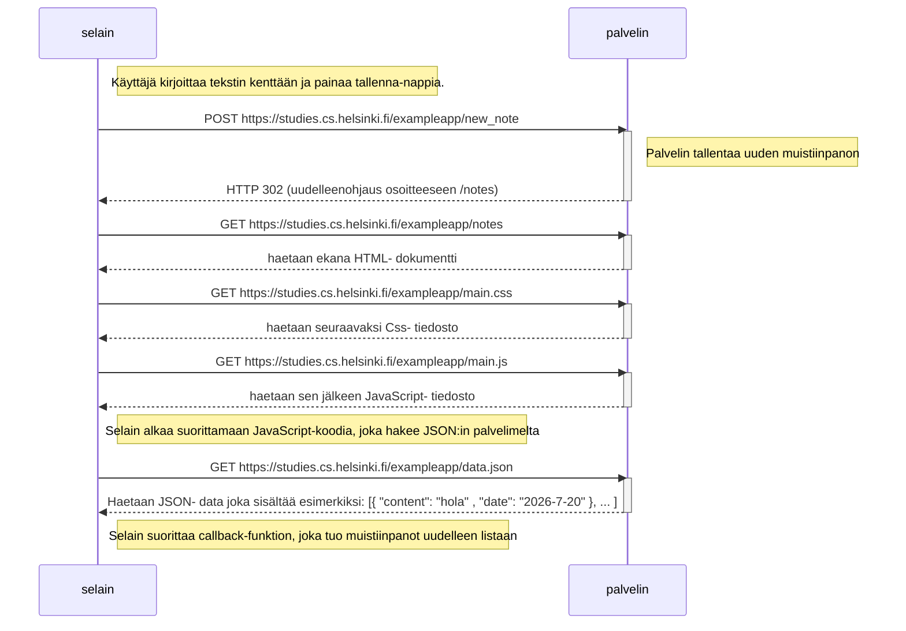
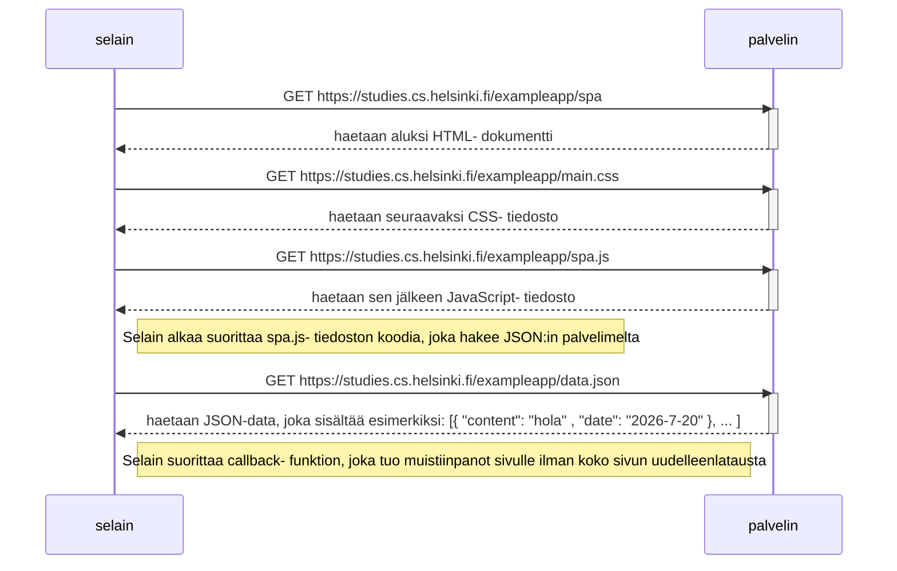
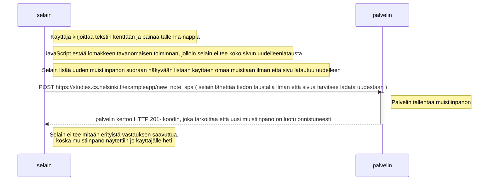

# Fullstack Osa 0 - tehtävät 0.4 , 0.5 ja 0.6 kaaviot

## 0.4 Uuden muistiinpanon luominen

## 0.5 SPA- sivun (Single Page App) lataaminen

## 0.6 Uuden noten luominen SPA- versiossa (Single Page App)

